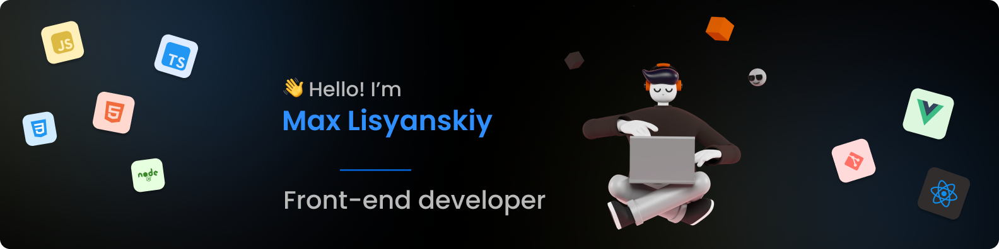

    <h3>Connect with me:</h3>  
    

### About Me
🏠 I'm middle **Front-end Developer** living in **Saint-Petersburg**.  
⭐ I'm currently learning **TypeScript** and **React**  
❤️ And I enjoy making beautiful web sites on **HTML**,**CSS** and **JavaScript**

### Languages and Tools:

 

