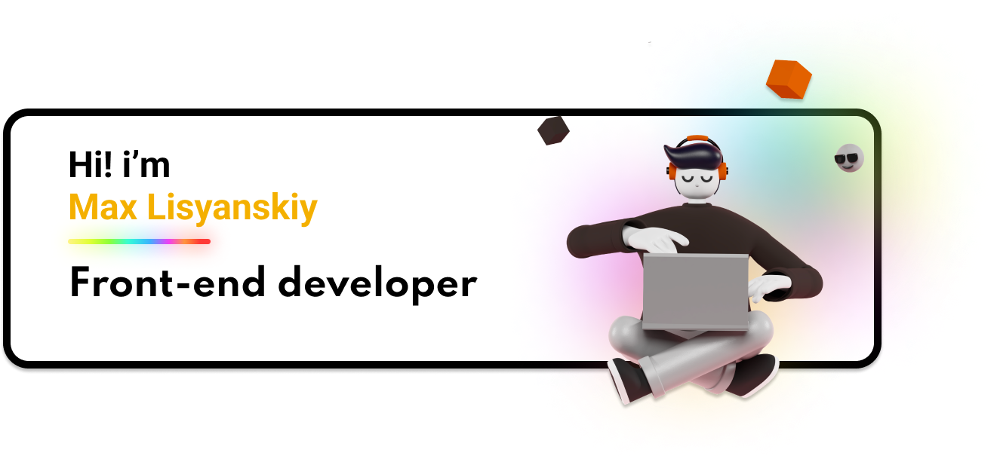

    <h2>Connect with me:</h2>
    
     
     
     
     

## About Me

🏠 I'm middle **Front-end Developer** living in **Saint-Petersburg**.  
⭐ I'm currently learning **TypeScript** and **React**  
❤️ And I enjoy making beautiful web sites on **HTML**,**CSS** and **JavaScript**

## [Check my Portfolio](https://maxlisyanskiy.github.io/portfolio/)

### Languages and Tools

<!-- ## Stats

 -->

